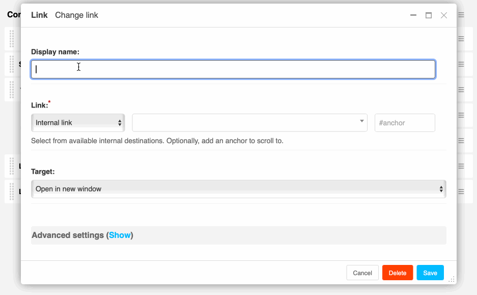

===============
django CMS Link
===============

|pypi| |coverage| |python| |django| |djangocms| |djangocms4|

**django CMS Link** is a plugin for `django CMS <https://django-cms.org>`_ that
allows you to add links on your site.

This plugin supports child plugins. If you add an other plugin as a
child it will take this content instead of the link name as the content of the link.

This addon is compatible with `Divio Cloud <http://divio.com>`_.

Contributing
============

This is a an open-source project. We'll be delighted to receive your
feedback in the form of issues and pull requests. Before submitting your
pull request, please review our `contribution guidelines
<http://docs.django-cms.org/en/latest/contributing/index.html>`_.

We're grateful to all contributors who have helped create and maintain this package.
Contributors are listed at the `contributors <https://github.com/divio/djangocms-link/graphs/contributors>`_
section.

One of the easiest contributions you can make is helping to translate this addon on
`Transifex <https://www.transifex.com/projects/p/djangocms-link/>`_.

Documentation
=============

See ``REQUIREMENTS`` in the `setup.py <https://github.com/divio/djangocms-link/blob/master/setup.py>`_
file for additional dependencies:

django CMS Link has a weak dependency on django Filer. If
`django Filer <http://django-filer.readthedocs.io/en/latest/installation.html>`_
is installed and configured appropriately, django CMS Link will allow linking
files.

* Django Filer 1.7 or higher
* djangocms-atrributes-field 1.0 or higher

Installation
------------

For a manual install:

* run ``pip install djangocms-link``
* add ``djangocms_link`` to your ``INSTALLED_APPS``
* run ``python manage.py migrate djangocms_link``

Configuration
-------------

Link templates
..............

Note that the provided templates are very minimal by design. You are encouraged
to adapt and override them to your project's requirements.

This addon provides a ``default`` template for all instances. You can provide
additional template choices by adding a ``DJANGOCMS_LINK_TEMPLATES``
setting:

.. code-block:: python

    DJANGOCMS_LINK_TEMPLATES = [
        ('feature', _('Featured Version')),
    ]

You'll need to create the ``feature`` folder inside ``templates/djangocms_link/``
otherwise you will get a *template does not exist* error. You can do this by
copying the ``default`` folder inside that directory and renaming it to
``feature``.

Link types
...........

By default, django CMS Link provides three major link types: internal, external,
and file link (if django-filer is installed).

Phone links or email links can be entered by using the ``tel:`` or ``mailto:``
scheme, respectively, in the external link field.

By changing the ``DJANGOCMS_LINK_ALLOWED_LINK_TYPES`` setting you can limit
the type of links accepted. The default is::

    DJANGOCMS_LINK_ALLOWED_LINK_TYPES = [
        'internal_link',  # Pages and other models
        'external_link',  # Hand-typed URLs
        'file_link',      # Files from django-filer
        'tel',            # Phone numbers as external links using the tel: scheme
        'mailto',         # Email addresses as external links using the mailto: scheme
        'anchor',         # Anchors in the current page as external links using #
    ]

Linkable models
...............

*Added in version 5:*

By default, django CMS Link will autodetect which Django or Django CMS models it
can create internal links to. To make a model appear in the list of internal
links, you need to

* register a model admin for the model and provide a ``search_fields``
  attribute. django CMS Link uses the same search logic as the Django admin.
* provide a ``get_absolute_url()`` method on the model. This method should
  return the URL of the model instance.

If you do not want to use auto detection, you can provide a list of models
in the ``DJANGOCMS_LINKABLE_MODELS`` setting using dotted strings::

    DJANGOCMS_LINKABLE_MODELS = [
        'myapp.mymodel',
    ]

Attention: ``Page`` objects are always linkable.

django CMS Link will use the model admin's ``get_queryset`` method to retrieve
the list of objects. If you want to add custom filters, sorting or site
handling, you can add a ``get_link_queryset`` method to the model admin::

    class MyModelAdmin(admin.ModelAdmin):
        def get_link_queryset(self, request, site_id):
            """Only used by djangocms-link: returns queryset to select link targets from."""
            qs = self.get_queryset(request)
            return qs.filter(is_public=True)

Large search-sets
..................

If you have a large number of internally linkable models, you can use the
``DJANGOCMS_LINK_MINIMUM_INPUT_LENGTH`` setting to require a minimum number of
characters typed before the search is triggered. The higher the number, the
smaller the average result set size. The default is 0::

    # Require at least 2 characters to be typed before searching for pages
    DJANGOCMS_LINK_MINIMUM_INPUT_LENGTH = 2

By default django CMS Link will paginate the search results. You can change the
page size by setting the ``DJANGOCMS_LINK_PAGINATE_BY`` setting.
The default is 50::

    # Show 100 results per "page"
    DJANGOCMS_LINK_PAGINATE_BY = 100

Note, that in the admin paginated search results repeat the modle verbose name.

Non-standard hostnames
......................

To support environments where non-standard URLs would otherwise work, this
project supports the defining of an additional RegEx pattern for validating the
host-portion of the URL.

For example:

.. code-block:: python

    # RFC1123 Pattern:
    DJANGOCMS_LINK_INTRANET_HOSTNAME_PATTERN = r'[a-z,0-9,-]{1,15}'

Either of these might accept a URL such as:

.. code-block:: html

    http://SEARCHHOST/?q=some+search+string

If left undefined, the normal Django URLValidator will be used.

Link fields
-----------

*Added in version 5:*

django CMS Link provides a re-usable link model field, form field and form
widget. This allows you to use the link field in your own models or admin forms.

.. code-block:: python

    from djangocms_link.fields import LinkField, LinkFormField, LinkWidget

    class MyModel(models.Model):
        link = LinkField()  # or LinkField(blank=True) for optional links

    class MyForm(forms.Form):
        link = LinkFormField(required=False)

``LinkField`` is a subclass of ``JSONField`` and stores the link data as
``djangocms_link.helpers.LinkDict``, a direct subclass of ``dict``.
(An empty link will be ``{}``.)

To render the link field in a template, convert the ``LinkDict`` to string,
use the ``LinkDict`` property ``url`` or the new template tag ``to_url``.
The ``type`` property returns the link type::

    {# Variant 1 #}
    
        <a href="{{ obj.link }}">Link available</a>  {# str(obj.link) gives the URL #}
    

    {# Variant 2 #}
    
        <a href="{{ obj.link.url }}">Link</a>  {# explicitly get the URL #}
    

      {# evaluate link type #}
        <a href="{{ obj.link.url }}">External link</a>
    

To turn the ``LinkField``'s ``LinkDict`` dictionary into a URL in python code,
use the ``url`` property. (It will hit the database if needed. Results are
cached.)::

    obj = MyModel.objects.first()
    url = obj.link.url

Running Tests
-------------

You can run tests by executing::

    virtualenv env
    source env/bin/activate
    pip install -r tests/requirements.txt
    pytest

Upgrading from version 4 or lower
---------------------------------

django CMS Link 5 is a rewrite of the plugin. If you are updating from
version 4 or lower, you will notice

* the **new re-usable link widget**, greatly simplifying the user interface
* an **improved management of multi-site situations**, essentially avoiding the
  unnecessary additon of the host name to the URL in plugin instances that
  are not in a page placeholder (such as links on aliases or static placeholder)
* a **re-usable admin endpoint** for querying available links which can be used
  by other apps such as djangocms-text.
* Links are generated by template tags or template filters instead of the
  model's ``get_link()`` method. This allows multiple links in future models. The
  ``get_link()`` method on the plugin's model is still available for backwards
  compatibility.

Migrations should automatically existing plugin instances to the new model
fields.

**WARNING:** We strongly recommend to backup your database before updating to
version 5. The migration is tested but they do remove unused fields from
the database. If you encounter any issues, please report them on
`GitHub <https://github.com/django-cms/djangocms-link/issues>`_.

.. |pypi| image:: https://badge.fury.io/py/djangocms-link.svg
    :target: http://badge.fury.io/py/djangocms-link
.. |coverage| image:: https://codecov.io/gh/django-cms/djangocms-link/branch/master/graph/badge.svg
    :target: https://codecov.io/gh/django-cms/djangocms-link

.. |python| image:: https://img.shields.io/badge/python-3.10+-blue.svg
    :target: https://pypi.org/project/djangocms-link/
.. |django| image:: https://img.shields.io/badge/django-4.2,%205.0,%205.1-blue.svg
    :target: https://www.djangoproject.com/
.. |djangocms| image:: https://img.shields.io/badge/django%20CMS-3.11%2B-blue.svg
    :target: https://www.django-cms.org/
.. |djangocms4| image:: https://img.shields.io/badge/django%20CMS-4-blue.svg
    :target: https://www.django-cms.org/

